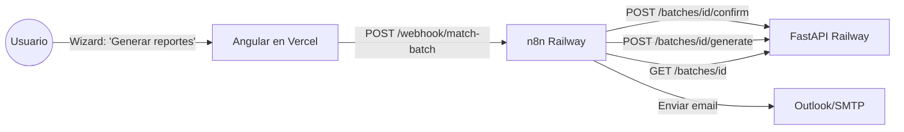

# n8n como orquestador (Fase 7D)

n8n corre como servicio en Railway (misma cuenta que el backend) y actua
como el "cerebro" del flujo. El backend expone los endpoints atomicos y
n8n los invoca en secuencia, mantiene estado, y notifica.

## Arquitectura



**Ventaja**: la logica de negocio vive en el backend FastAPI (testeada,
con 204 tests). n8n solo orquesta y notifica. Migrar a Copilot Studio en
el futuro es re-crear el mismo flow visual, sin cambiar el backend.

## Deploy de n8n en Railway

1. En el mismo proyecto Railway del backend, crear un servicio nuevo:
   `+ New` -> `Docker Image` -> `n8nio/n8n:latest`.
2. Config del servicio:
   - **Port**: 5678 (n8n default).
   - **Volume**: mount path `/home/node/.n8n` (para persistir workflows y
     credenciales encriptadas).
3. Env vars:
   ```
   N8N_HOST=n8n-<hash>.up.railway.app
   N8N_PROTOCOL=https
   WEBHOOK_URL=https://n8n-<hash>.up.railway.app
   N8N_ENCRYPTION_KEY=<generar 32 chars random>
   N8N_BASIC_AUTH_ACTIVE=true
   N8N_BASIC_AUTH_USER=admin
   N8N_BASIC_AUTH_PASSWORD=<password fuerte>
   API_BASE_URL=https://nutriavicola-api.up.railway.app
   NOTIF_EMAIL_TO=bi@nutriavicola.com
   ```
4. Generar dominio publico: `Settings` -> `Networking` -> `Generate Domain`.

## Workflow: match-batch

Importar [n8n_workflow_match_batch.json](../n8n/n8n_workflow_match_batch.json)
en n8n (Import from File). Estructura:

```
Webhook (POST /webhook/match-batch, body: {batch_id})
   -> HTTP Request: POST {{API_BASE_URL}}/batches/{{batch_id}}/confirm
   -> IF status == 200:
       -> HTTP Request: POST {{API_BASE_URL}}/batches/{{batch_id}}/generate
       -> IF status == 200:
           -> HTTP Request: GET {{API_BASE_URL}}/batches/{{batch_id}}/downloads
           -> Send Email (Outlook o SMTP): resumen + link a downloads
       ELSE:
           -> Send Email: alerta de error en generate
   ELSE:
       -> Send Email: alerta de error en confirm
```

## Frontend: opcional integrar el webhook

El frontend (Fase 7C) ya llama `POST /confirm` + `POST /generate`
directamente desde `BatchWizardComponent.confirmAndGenerate()`. Con n8n
en el medio, se cambia una linea:

```typescript
// frontend/src/environments/environment.prod.ts
n8nWebhookMatch: 'https://n8n-<hash>.up.railway.app/webhook/match-batch',

// batch-wizard.component.ts
this.http.post(environment.n8nWebhookMatch, { batch_id: id }).subscribe(...)
```

**Ventaja del webhook**: n8n dispara notificaciones al equipo BI sin que
el frontend tenga que saber a quien.

**Cuando NO usar n8n**: si el equipo prefiere flujo sincrono y no requiere
notificaciones, el frontend puede seguir llamando confirm+generate
directamente (setup actual de Fase 7C).

## Workflow futuro: cleanup

Segundo workflow (opcional, cron): purga batches archived > 90 dias
y libera espacio del volumen Railway.

```
Cron (weekly)
   -> HTTP GET /batches?include_archived=true
   -> Filter: status == 'archived' && updated_at < NOW() - 90d
   -> Loop: DELETE /batches/{id}
```

## Migracion a Copilot Studio (Fase futura)

Cuando el negocio pida integrar Microsoft Copilot Studio (mismo tenant que
Outlook/Teams), los workflows se re-crean 1-a-1 como Power Automate flows.
Los endpoints del backend NO cambian. El upgrade path esta preservado.
